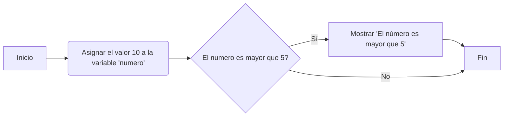
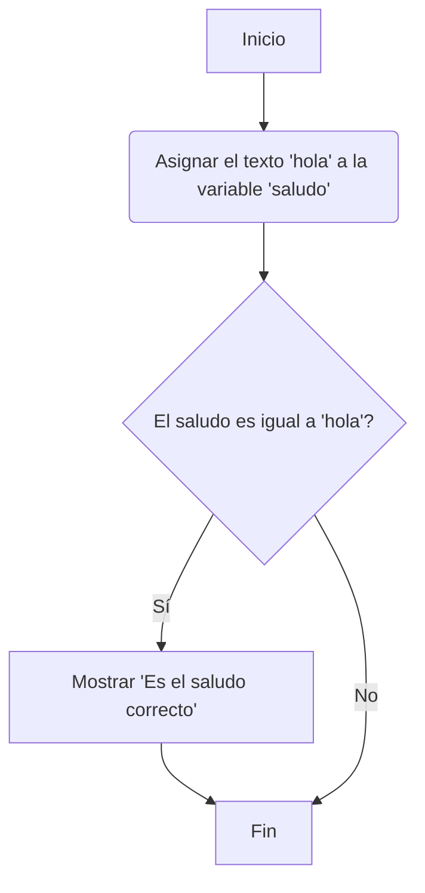

# Python - Desafio Latam

[Python Interactivo](https://sqlinteractivo.desafiolatam.com/cursos);

## Hola Mundo

### 01: Hola Mundo

> La primera frase de un programa!

```python
print("hola mundo")
```

### 02: Comentários

> Son ignorados a la hora de ejecutar el programa

Comandos | Python
:-|-
.# | Comentário de linha
' ' ' | Comentário de textos (docstring)

### 03: Operaciones Matemáticas 

```python
print(2 + 2) # Mostrará 4 (sin " ")
```

### 04: Variables

> Cajas donde podemos guardar y modificar información durante la ejecución del programa.

resultado = 17 + 15 

```python
resultado = 17 + 15 
print(resultado)
```

```python
manzanas = 7
naranjas = 5
peras = 8
print(manzanas + naranjas + peras); # Modifica esta línea

#Resultado 20
```

### 05: Modificando Variables

> La información de la caja puede modificarse al almavenar un nuevo dato

```python
edad = 30
print(edad) # Se mostrará 30 
edad = 31
print(edad) # Se mostrará 31
```

*Ejercicio*
Modifica el valor de la variable peras en la segunda suma para que el resultado sea 12.

```python
manzanas = 7
naranjas = 5
peras = 8
# print(manzanas + naranjas + peras) mostraría 20
# Ahora asignamos nuevos valores a las variables
manzanas = 10
naranjas = 1
peras = 1 # Modifica esta línea para 1
print(manzanas + naranjas + peras)
# Resultado 12
```

### 06: Variables vs Texto

```python
print("hola") # Aquí se muestra el texto hola.
print(hola) # Aquí se muestra el valor de la variable hola.
print(2) # Aquí se muestra el número 2.
```

*Ejercicio*
Modifica la línea dentro del print para que muestre el valor de la `variable a` en lugar de la `letra a`.

```python
a = "Hola Mundo"
print(a); # Apagué los "  " que estaban dentro de la a.
```

### 07: Reglas de identificadores

* Los identificadores son nombres (nombres de las variables)

> Pueden contener letras, números y guiones bajos: `holaMundo` `mundo01` `hola_mundo`.
> NO pueden empezar por un número: `01mundo`
> NO pueden contener espacios: `Hola Mundo`.

*Ejercicio*
Modifica los nombres de las variables para que sean válidos.

```python
# Escribe tu código aquí
hola23 = "Hola Mundo" # estaba 23hola
hola_mundo = "Hola Mundo" # estaba hola-mundo
# Fin
print(hola23)
print(hola_mundo)
```

### 08: Introducción a tipos de datos

*Ejercicio*
Modifica el valor asignado a la variable a para que el resultado sea el número 4.

```python
a = 2;  # Modifica esta línea: estaba "2".
b = 2;
print(a + b);
```
## Comparaciones y flujo

### 01: Comparaciones de Igualdad

> operador de igualdad ==

- [X] Si son iguales, el resultado es True.
- [x]  Si no son iguales, el resultado es False.

```python
print(2 == 2) # True (verdadero) 
print(2 == 3) # False (falso)
```

Podemos utilizar los operadores de comparación con variables

```python
manzanas = 7
naranjas = 5
print(manzanas == naranjas) # False
```

*Ejercicio*
Utiliza print y el operador de igualdad para comparar si tenemos la misma cantidad de calcetines izquierdos que derechos.

```python
calcetinesIzquierdos = 13
calcetinesDerechos = 17
print(calcetinesDerechos == calcetinesIzquierdos) # Modifica esta línea: resultado False.
```

### 02: Comparaciones de mayor y menor

> `>` maior y `<` menor

**Ejercicio**
Un programador ha escrito el siguiente código para comparar dos números. Sin embargo, el programa no está funcionando correctamente. ¿Puedes corregirlo únicamente cambiando el signo de comparación?

```python
a = 4
b = 3
c = a > b  # Modifica esta línea: estaba `c = a < b`
print("a es mayor que b: " + str(c))
```

### 03: Otros tipos de comparadores

Operador | Tipo de comparación|	Ejemplo|	Resultado
-|-|-|-
==|	Igualdad|	2 == 2|	true
`>`|	Mayor que	|3 > 2|	true
`<`|	Menor que|	2 < 3	|true
`>=`|	Mayor o igual que	|3 >= 3|	true
`<=`|	Menor o igual que	|3 <= 3	|true
!=	|Distinto	|1 != 2	|true

**Ejercicio**
Un programador ha escrito esta sección de código para evaluar si tiene suficiente dinero para comprar un producto. Sin embargo, el programa tiene un caso no contemplado. ¿Puedes corregirlo?

Tip: El caso no contemplado puede ser resuelto utilizando uno de los operadores de comparación mencionado en la tabla anterior.

```python
dinero = 500
costo = 500
me_alcanza = dinero == costo # Modifica esta línea: añadido las ==
print(me_alcanza)
```

### 04: Introducción a flujo

> El orden en el que se ejecutam las instrucciones 

```python
if condición:
  # Código a ejecutar si la condición es verdadera
  ```

  ```python
  edad = 18
if edad >= 18: 
    print("Eres mayor de edad")
  ```

  > La indentación es OBLIGATORIA! Mira em `print("Eres mayor de edad")`

 **Ejercicio**
El siguiente programa está mal configurado, alguien cambió la contraseña y ahora no funciona correctamente. Debería mostrar que el código es correcto si la variable `codigo` es igual a "1234". Sin embargo, el programa no muestra nada en absoluto. ¿Puedes corregirlo? 

```python
codigo = "9371" # Modifica esta línea para 1234
if codigo == "1234": 
  print("Código correcto")
```

### 05: Introducción a diagramas de flujo

> La ordem en que se ejecutan el programam, de arriba hasta abajo.

#### Código y diagramas de flujo

Veamos un ejemplo lineal primero.

```python
print("Inicio del programa")
print("Instrucción 1")
print("Instrucción")
print("Instrucción")
```

 ```mermaid
graph TD
    A[Inicio do Programa]
    A-->B[Instrucción 1]
    B-->C[Instrucción 2]
    C-->D[Instrucción 3]
    D-->E[Fin del Programa]
```

```python
numero = 10
if numero > 5:
    print("El número es mayor que 5")    
```



**Ejercicio**
Implementa el siguiente código a partir de un diagrama de flujo.



```python
# Escribe tu código aquí: el código está correcto.
saludo = 'hola'
if saludo == 'hola':
    print('Es el saludo correcto')
# Fin
```