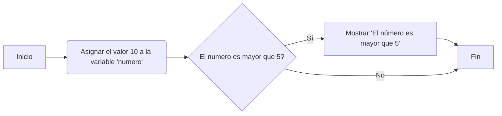
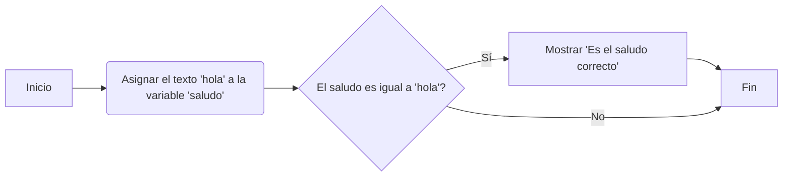

# Python - Santander

[Python Santander](https://lms.santanderopenacademy.com/courses/508).


<details><summary>01: Hola Mundo</h2></summary>


### 01.01: Hola Mundo

> La primera frase de un programa!

```python
print("hola mundo")
```

### 01.02: Comentários

> Son ignorados a la hora de ejecutar el programa

Comandos | Python
:-|-
.# | Comentário de linha
' ' ' | Comentário de textos (docstring)

### 01.03: Operaciones Matemáticas 

```python
print(2 + 2) # Mostrará 4 (sin " ")
```

### 01.04: Variables

> Cajas donde podemos guardar y modificar información durante la ejecución del programa.

resultado = 17 + 15 

```python
resultado = 17 + 15 
print(resultado)
```

```python
manzanas = 7
naranjas = 5
peras = 8
print(manzanas + naranjas + peras); # Modifica esta línea

#Resultado 20
```

### 01.05: Modificando Variables

> La información de la caja puede modificarse al almavenar un nuevo dato

```python
edad = 30
print(edad) # Se mostrará 30 
edad = 31
print(edad) # Se mostrará 31
```

*Ejercicio*
Modifica el valor de la variable peras en la segunda suma para que el resultado sea 12.

```python
manzanas = 7
naranjas = 5
peras = 8
# print(manzanas + naranjas + peras) mostraría 20
# Ahora asignamos nuevos valores a las variables
manzanas = 10
naranjas = 1
peras = 1 # Modifica esta línea para 1
print(manzanas + naranjas + peras)
# Resultado 12
```

### 01.06: Variables vs Texto

```python
print("hola") # Aquí se muestra el texto hola.
print(hola) # Aquí se muestra el valor de la variable hola.
print(2) # Aquí se muestra el número 2.
```

*Ejercicio*
Modifica la línea dentro del print para que muestre el valor de la `variable a` en lugar de la `letra a`.

```python
a = "Hola Mundo"
print(a); # Apagué los "  " que estaban dentro de la a.
```

### 01.07: Reglas de identificadores

* Los identificadores son nombres (nombres de las variables)

> Pueden contener letras, números y guiones bajos: `holaMundo` `mundo01` `hola_mundo`.
> NO pueden empezar por un número: `01mundo`
> NO pueden contener espacios: `Hola Mundo`.

*Ejercicio*
Modifica los nombres de las variables para que sean válidos.

```python
# Escribe tu código aquí
hola23 = "Hola Mundo" # estaba 23hola
hola_mundo = "Hola Mundo" # estaba hola-mundo
# Fin
print(hola23)
print(hola_mundo)
```

### 01.08: Introducción a tipos de datos

*Ejercicio*
Modifica el valor asignado a la variable a para que el resultado sea el número 4.

```python
a = 2;  # Modifica esta línea: estaba "2".
b = 2;
print(a + b);
```

</details>

<details><summary> 02: Comparaciones y flujo </summary>
 
### 02.01: Comparaciones de Igualdad

> operador de igualdad ==

- [X] Si son iguales, el resultado es True.
- [x]  Si no son iguales, el resultado es False.

```python
print(2 == 2) # True (verdadero) 
print(2 == 3) # False (falso)
```

Podemos utilizar los operadores de comparación con variables

```python
manzanas = 7
naranjas = 5
print(manzanas == naranjas) # False
```

*Ejercicio*
Utiliza print y el operador de igualdad para comparar si tenemos la misma cantidad de calcetines izquierdos que derechos.

```python
calcetinesIzquierdos = 13
calcetinesDerechos = 17
print(calcetinesDerechos == calcetinesIzquierdos) # Modifica esta línea: resultado False.
```

### 02.02: Comparaciones de mayor y menor

> `>` maior y `<` menor

**Ejercicio**
Un programador ha escrito el siguiente código para comparar dos números. Sin embargo, el programa no está funcionando correctamente. ¿Puedes corregirlo únicamente cambiando el signo de comparación?

```python
a = 4
b = 3
c = a > b  # Modifica esta línea: estaba `c = a < b`
print("a es mayor que b: " + str(c))
```

### 02.03: Otros tipos de comparadores

Operador | Tipo de comparación|	Ejemplo|	Resultado
-|-|-|-
==|	Igualdad|	2 == 2|	true
`>`|	Mayor que	|3 > 2|	true
`<`|	Menor que|	2 < 3	|true
`>=`|	Mayor o igual que	|3 >= 3|	true
`<=`|	Menor o igual que	|3 <= 3	|true
!=	|Distinto	|1 != 2	|true

**Ejercicio**
Un programador ha escrito esta sección de código para evaluar si tiene suficiente dinero para comprar un producto. Sin embargo, el programa tiene un caso no contemplado. ¿Puedes corregirlo?

Tip: El caso no contemplado puede ser resuelto utilizando uno de los operadores de comparación mencionado en la tabla anterior.

```python
dinero = 500
costo = 500
me_alcanza = dinero == costo # Modifica esta línea: añadido las ==
print(me_alcanza)
```

### 02.04: Introducción a flujo

> El orden en el que se ejecutam las instrucciones 

```python
if condición:
  # Código a ejecutar si la condición es verdadera
  ```

  ```python
  edad = 18
if edad >= 18: 
    print("Eres mayor de edad")
  ```

  > La indentación es OBLIGATORIA! Mira em `print("Eres mayor de edad")`

 **Ejercicio**
El siguiente programa está mal configurado, alguien cambió la contraseña y ahora no funciona correctamente. Debería mostrar que el código es correcto si la variable `codigo` es igual a "1234". Sin embargo, el programa no muestra nada en absoluto. ¿Puedes corregirlo? 

```python
codigo = "9371" # Modifica esta línea para 1234
if codigo == "1234": 
  print("Código correcto")
```

### 02.05: Introducción a diagramas de flujo

> La ordem en que se ejecutan el programam, de arriba hasta abajo.

#### Código y diagramas de flujo

Veamos un ejemplo lineal primero.

```python
print("Inicio del programa")
print("Instrucción 1")
print("Instrucción")
print("Instrucción")
```

 ```mermaid
graph TD
    A[Inicio do Programa]
    A-->B[Instrucción 1]
    B-->C[Instrucción 2]
    C-->D[Instrucción 3]
    D-->E[Fin del Programa]
```

```python
numero = 10
if numero > 5:
    print("El número es mayor que 5")    
```



**Ejercicio**
Implementa el siguiente código a partir de un diagrama de flujo.



```python
# Escribe tu código aquí: el código está correcto.
saludo = 'hola'
if saludo == 'hola':
    print('Es el saludo correcto')
# Fin
```

### 02.06: Indentando con espacios

**Ejercicio**
Modifica el siguiente código para que funcione.

```python
codigo = "1234" 
if codigo == "1234": 
  print("Código correcto")
    print("Segundo mensaje") # Modifica esta línea: con espacio a más
```

### 02.07: Salundando a Alex

**Ejercicio**
Se ha diseñado un programa en Python con la intención de imprimir un mensaje de bienvenida a los usuarios cuyo nombre coincide con "Alex".

Sin embargo, tras realizar algunas modificaciones en el código, el programa ha dejado de funcionar correctamente y ya no muestra el mensaje de bienvenida adecuado. Corrige el error en el siguiente código para que funcione correctamente.

```python
nombreUsuario = "Juan" # Modifica esta línea: modificar para Alex
if nombreUsuario == "Alex":
  print("Bienvenido, Alex");
```

### 02.08: Bloques de código

> Un bloque es un conjunto de instrucciones que se ejecutan juntas, se delimitan pela identación

```python
if condición:
  # Conjunto de instrucciones si la condición se cumple
else:
  # Conjunto de instrucciones si la condición no se cumple
```

**Ejercicio**
El programador que escribió este código no dejó los prints dentro del bloque if por lo que el código no funciona como debería. ¿Puedes corregirlo?

```python
# Escribe tu código aquí 
formulario = "incompleto";
if formulario == "completo":
    print("Formulario completo");
    print("Enviando email"); 
print("Este mensaje debe aparecer siempre"); 
# Fin
```

### 02.09: Ejercicio de bloque

**Ejercicio**
Un programador está desarrollando un videojuego y ha escrito el siguiente código para que, cuando la puerta esté abierta, se muestre un mensaje. Sin embargo, el programa no está funcionando correctamente. ¿Puedes corregirlo dejando el mensaje respectivo dentro del bloque donde sea necesario?

```python
# Escribe tu código aquí
puerta = "cerrada"
if puerta == "abierta":
  print("Detrás de la puerta hay un tesoro")
print("Dentro del tesoro hay 50 monedas de oro") #TAB aqui!
print("Este mensaje debe aparecer siempre independientemente de si la puerta está abierta o cerrada")
# Fin
```

</details>

<details>
<summary>03. Funciones</summary>

### 03.01: Introducción a funciones

> Son definidas y llamadas a lo largo del programa. Son bloques de código que nos permiten reutilizar y estructurar nuestro código de una manera más organizada.

~~~python
# Definimos la función 

def saludar():
  print("Hola Mundo")

saludar() # Llamamos a la función
saludar() # Llamamos a la función una segunda vez
saludar() # Llamamos a la función una tercera vez
~~~

Ejercicio
Se tiene definida la función `despedir`, pero no se está llamando. Llama a la función despedir para que imprima "Adiós Mundo" en la consola.

~~~python
def despedir():
  print("Adiós Mundo") 
  #llamar la función
despedir()

# Fin
~~~

### 03.02: Creando una función

</details>